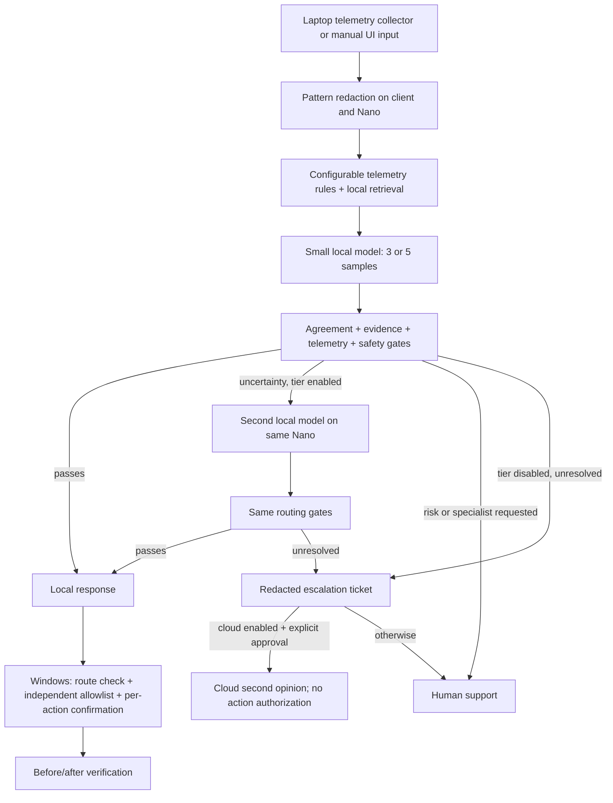

# EdgeSupport — integrated site-local IT triage

Combines the original privacy/telemetry pipeline with the teammate's FastAPI backend, endpoint collectors, action IDs and verification. The Nano performs primary inference; cloud is optional and requires a recorded escalation plus explicit approval. Endpoint changes remain separately confirmed on Windows.

**Current status:** the fix branch records 98 passing tests in its validation log; this abstention change adds four regression tests that must be rerun in the target environment. The team previously confirmed Qwen2.5-7B-Instruct was Ready on its Nano, but this integrated version has not yet been validated against that server. No larger local model, cloud benchmark, production dataset or fine-tuning result is claimed.


## At a glance

**Target user.** A Tier-1 IT help-desk technician supporting employees at a site with many laptops (a hospital,
school district or factory). Their telemetry and logs contain e-mails, user paths and internal IPs that stay on
premises, and their most common ticket ("websites won't load") is exactly when a cloud assistant is unreachable.

**What it does.** Diagnoses the laptop problem on the site's ZGX Nano. It escalates, with a reason code, only
when the evidence doesn't support answering locally.

**Why the cloud alone can't:**
- **Data residency.** Raw telemetry never leaves. Planted identifiers leaked into outputs are measured.
- **No connectivity.** Diagnosis needs only the Nano; `FORCE_OFFLINE=true` demonstrates the uplink cut.
- **Latency.** Answered on the Nano; p50/p95 are measured.
- **Cost.** Only deferred tickets can reach the cloud, and only on approval; bytes and tokens sent are measured.

**How it decides.**
1. Risk, a specialist request or a failed fix goes to a person.
2. Otherwise the local model answers 3–5 times in one batched request.
3. The ticket stays local only if the answers agree (≥ τ), cite an existing `signal:`/`kb:` ID, the telemetry
   agrees, and the fix is known and low-risk.
4. τ and the gate mode are chosen on `data/eval/calib.jsonl` and locked before `test.jsonl` and `test_hard.jsonl`
   are scored.

When any uncertainty or safety gate fires, the router exposes an explicit system-level abstention in
`route.abstained` and `route.abstention`, blocks the action plan, and records the reason codes. Cloud remains a
separate, human-approved second-opinion path; it never authorizes an endpoint action.

### Results

<!-- RESULTS:START -->

_Pending the Nano run: `bash scripts/run_matrix.sh`, then `scripts/update_readme_results.py reports/base/summary.json`.
This block is generated from `reports/`; no number here is typed by hand._

<!-- RESULTS:END -->

### Test everything on the Nano in one session

**[docs/NANO_RUNBOOK.md](docs/NANO_RUNBOOK.md)** has the commands in order.
`scripts/run_matrix.sh` covers every configuration, each calibrated then tested, plus the 1/3/5-sample sweep.
Then optional fine-tuning, `scripts/compare_runs.py`, and publishing results to this README and the deck.

### v2 switches

Each is set in `.env`. A blank value keeps the original behaviour, so old and new can be compared in one session.

| Switch | Effect |
|---|---|
| `STRICT_SCHEMA=true` | Enum category/action IDs + required evidence, enforced at decode time (also sequential + cloud calls) |
| `COMPACT_PROMPT=true` | Drops the schema text from the prompt when the server already enforces it |
| `GATE_MODE=majority` | One hedging/malformed sample no longer vetoes; risk gates stay strict |
| `LENIENT_PARSE=true` | Recovers JSON from `<think>`, code fences, prose and common type slips |
| `RETRIEVAL=bm25` | One ranked index over both corpora; unique `kb:runbooks/…` / `kb:knowledge/…` IDs |
| `LOCAL_REDACTION=keep_network` | IPs reach the on-site model (diagnostic); every output stays fully redacted |
| `MAX_OUTPUT_TOKENS=450` | Output cap per sample (defaults: 700 batched / 1500 sequential) |
| `FORCE_OFFLINE=true` | Demo: behave as if the uplink were down |

The evaluation adds:
- a rules-only baseline,
- planted-PII leak counts and bytes leaving the site,
- estimated or measured cloud cost (`CLOUD_PRICE_*`, `--cloud-baseline`, `--cloud-escalations`),
- GPU energy where `nvidia-smi` exposes it,
- per-kind breakdowns, Wilson intervals, both gate modes' sweeps, and `--workers` for concurrent tickets.

### Submission materials

- Interactive deck: [docs/presentation/index.html](docs/presentation/index.html). It's offline, single-file,
  and results are embedded by `scripts/build_deck.py`.
- [Demo run sheet](docs/DEMO_SCRIPT.md), [pitch + Q&A](docs/PITCH.md), [2-min video script](docs/VIDEO_SCRIPT.md)
- [Project brief](docs/PROJECT_BRIEF.md), [checklist + social posts](docs/SUBMISSION_CHECKLIST.md)

## What changed

- Restored original pattern redaction, configurable telemetry rules and both sample knowledge corpora.
- Added configurable repeated sampling (3 by default; 5 optional), category/action agreement and telemetry/evidence checks. Self-reported confidence is displayed, not trusted as a routing probability.
- Added optional second local model tier and explicit cloud second-opinion endpoint. High-risk/user-requested cases go to support regardless of agreement.
- Fixed null Windows telemetry simulation errors, severity gates, collector routing enforcement, exact-target verification and simulation labels.
- Removed forced process termination and automated file deletion. The Python action library is dry-run only; Windows executes only explicitly confirmed DNS flush or graceful closing of an allowed demo app.
- Added per-request token/latency reporting, a threshold sweep, endpoint telemetry sender and dashboard monitoring.
- Fixed launcher/virtual-environment mismatch and API startup readiness checks.

The original `app/` workflow and its tests remain available; see [legacy instructions](docs/LEGACY_README.md). The integrated entry point is `bash run_demo.sh`, not `streamlit run app/ui.py`.

## Architecture



API port: **8502**. Dashboard port: **8501**. Small model: **8000**. Optional second local server: **8001**. These ports are on the Nano; forwarded Mac ports may differ.

## Safely obtain this integration on the Nano

Your existing Nano checkout has untracked teammate files. Preserve it; use a new directory from the remote VS Code/SSH terminal:

```bash
cd ~
git clone --branch integrate-edge-routing https://github.com/abhinitasanabada-web/edgehack.git edgehack-integrated
cd edgehack-integrated
bash scripts/setup.sh
```

Python 3.12 is recommended. Setup installs `requirements-lock.txt`, creates `.env` only if absent and builds the original local index. Dependencies/model downloads need internet; runtime does not require cloud access for local cases. Do not copy a Mac `.venv` onto the Nano.

## Configure the existing Nano model

Check the already-running service; do not start a duplicate:

```bash
zrt status
curl --max-time 10 http://127.0.0.1:8000/v1/models
nano .env
```

The team's reported served model ID was `hf:Qwen/Qwen2.5-7B-Instruct`. Set the exact current ID returned by your server:

```dotenv
LOCAL_LLM_BASE_URL=http://127.0.0.1:8000/v1
LOCAL_LLM_MODEL=hf:Qwen/Qwen2.5-7B-Instruct
LOCAL_LLM_API_KEY=
LOCAL_SAMPLE_COUNT=3
SAMPLE_TEMPERATURE=0.4
AGREEMENT_THRESHOLD=0.8
ENABLE_LARGE_LOCAL=false
ENABLE_CLOUD=false
SIMULATION_MODE=false
EDGE_SUPPORT_API_PORT=8502
```

Keep credentials in `.env`, which is ignored by Git. Loopback endpoint validation assumes this is actually the Nano or a private tunnel to it; it cannot prove hardware residency. The model must support the OpenAI-compatible chat-completions API. The adapter requests 1500 output tokens per sample. Budget for repeated sequential requests; a 90-second timeout is per request, not per incident.

## Run and open the dashboard

Stop the previous Streamlit app on port 8501 with Ctrl+C in its terminal. Keep ZRT running. Then:

```bash
bash run_demo.sh
```

In VS Code's remote **Ports** panel forward **8501** and open its displayed address. For example, Nano port 8501 may map to Mac `127.0.0.1:8502`; always use the displayed address. The dashboard reaches the API inside the Nano, so dashboard-only use does not require forwarding API port 8502.

For a local workflow check without model calls:

```bash
SIMULATION_MODE=true bash run_demo.sh
```

Simulation is visibly labeled and cannot authorize cloud calls or endpoint changes. Default manual test: complaint `My laptop is slow during video calls`, telemetry `{"memory_percent":94}`. Review model-reported confidence separately from measured sample agreement, reason codes, sources, telemetry signals, tokens and latency. Evidence IDs are checked for existence and known telemetry consistency; this does not prove full semantic grounding.

## Send live laptop telemetry

Run the collector **on the laptop you want to diagnose**, not on the Nano. It collects actual CPU/memory/disk/process information; it does not deliberately create CPU load or execute fixes.

Forward Nano API port **8502** to a free laptop port, for example **8503**, using a private SSH tunnel. Run this in a separate Mac terminal with your assigned details:

```bash
ssh -N -L 8503:127.0.0.1:8502 YOUR_ASSIGNED_USERNAME@YOUR_ASSIGNED_HOST
```

Clone/install this branch on the laptop in a separate folder as above, then run there:

```bash
.venv/bin/python -m edge_support.collector.send --api-url http://127.0.0.1:8503 --complaint "Laptop slow during work" --count 3 --interval 30
```

Click **Load latest redacted endpoint incident** in the dashboard, or enable its five-second summary monitor. Each collector iteration triggers inference: the actual interval includes collection and model time. This is a serialized prototype, not a high-frequency fleet monitor. `/latest` is shared across the demo API's callers; do not treat it as per-user isolation.

Optional shared API authentication: set a strong `EDGE_SUPPORT_ACTION_TOKEN` on the Nano and in the collector environment, and restart services. It protects API access but is not multi-user authentication or action authorization. Use private tunnels; do not publish these ports. Records are redacted, in memory only, expire after 30 minutes and are capped at 100. Anyone authorized to the shared API can see its latest record. Redaction is pattern-based, not complete DLP; names/IPv6/proprietary text may remain.

## Windows actions

In Windows PowerShell, from the project folder with a private API tunnel on that Windows machine:

```powershell
.\edge_support\collector\windows_collector.ps1 -ApiUrl "http://127.0.0.1:8503" -Complaint "Websites fail to resolve"
```

This is diagnosis-only. Add `-AutoApply` to permit a per-action prompt after a LOCAL route. The endpoint independently allows only DNS cache flush or graceful closing of a named demo app (`notepad`, `calculatorapp`, `mspaint`). It still requires typing `APPLY`; the old `-Confirmed` switch cannot bypass that prompt. Save work first. The collector will not execute an escalated, simulation or high-risk plan. Follow the organization's PowerShell policy; the README no longer instructs users to bypass it.

Verification checks DNS improvement or disappearance of the exact requested process with a successful action outcome. Closing a process alone is not proof that the original performance issue was solved. Failed verification should be followed by another diagnosis with **Troubleshooting failed** selected. Windows execution remains pending validation on an actual Windows test endpoint.

## Optional larger local tier

Only enable after the team has separately served and measured a second model on the same Nano:

```dotenv
ENABLE_LARGE_LOCAL=true
LARGE_LLM_BASE_URL=http://127.0.0.1:8001/v1
LARGE_LLM_MODEL=EXACT_SECOND_SERVED_MODEL_ID
LARGE_LLM_API_KEY=
```

The app does not download or schedule models. Two servers' weights, cache and concurrency must fit the actual available unified memory. The sample count applies to each tier (up to 10 requests for 5 samples and 2 tiers). The larger tier is only for uncertainty, not overriding human/physical/security-risk gates. A primary local outage is a clear error with no automatic cloud fallback. A secondary outage preserves the small-tier result and adds an escalation reason.

## Optional cloud or human escalation

Set `ENABLE_CLOUD=true`, `CLOUD_LLM_BASE_URL` (HTTPS), `CLOUD_LLM_MODEL`, and `CLOUD_LLM_API_KEY` only if you intend to allow the explicit cloud path. Review the redacted ticket, approve it and click **Send approved cloud escalation**. The API uses its stored incident/route rather than trusting a client-supplied diagnosis. An incident is attempted at most once to avoid accidental duplicate sends. A failed request may already have transmitted data; use the local ticket for support. A cloud second opinion never authorizes endpoint execution. With cloud disabled, download a ticket for human support.

## Benchmarks and token comparison

```bash
.venv/bin/python -m pytest -q
.venv/bin/python eval/evaluate.py --simulate --samples 3 --output reports/simulation.json
# Actual local model, one run per sampling budget:
.venv/bin/python eval/evaluate.py --samples 1 --output reports/nano-1.json
.venv/bin/python eval/evaluate.py --samples 3 --output reports/nano-3.json
.venv/bin/python eval/evaluate.py --samples 5 --output reports/nano-5.json
```

Each run writes JSON plus a threshold-sweep CSV. The sweep reports local acceptance coverage, category error among accepted cases, abstention rate, blocked unsafe-action rate, and unsafe accepts relative to labels. It measures small-tier deferral only: it does not invent large-tier, cloud cost or energy outcomes. One sample is a conservative always-defer baseline. Use an independently labeled calibration split to select a threshold, then lock it before evaluating a held-out test split (`--dataset PATH`). The bundled 13 synthetic cases are not adequate for production calibration; no measured cutoff is claimed. Optional `--warmup` excludes one warmup request from reported case measurements.

Per-request `prompt_tokens`, `completion_tokens`, `total_tokens`, model/tier and round-trip latency come from actual responses. Missing usage is null; malformed JSON responses still retain available token usage. Requests interrupted by transport errors may have unknown usage. No energy/cost is estimated from tokens. See [design assessment](docs/DESIGN_ASSESSMENT.md) for a fair comparison plan and [legacy token comparison instructions](docs/LEGACY_README.md) for a separately approved cloud baseline. That legacy example uses the older prompt, so do not compare its numbers directly against the integrated prompt as if workloads were identical.

For a workload comparison, measure all cloud-only requests versus actual approved cloud escalations under the same cloud model and cases. Report local usage separately. Account for extra escalation context, input/output prices, failed calls and human handoffs. Agreeing samples can still be wrong; more samples can increase latency and energy. No real savings are claimed yet.

## Models, datasets and fine-tuning

- Local deployment observed by the team: Qwen2.5-7B-Instruct via ZRT. Integrated real inference still needs validation.
- Training/fine-tuning: pipeline added (see below); no fine-tuned result measured yet. Larger local and cloud models: not yet measured.
- Original corpus: 9 sample documents; teammate corpus: 12 sample runbooks. Retrieval combines lexical hits from both, not a learned semantic reranker. Their scores use different scales.
- Evaluation: 13 original synthetic incidents; 3 teammate examples retained in `eval/incidents.jsonl`. No external public dataset has been used.
- Evaluation split: `scripts/make_dataset.py` generates 387 train / 151 test synthetic tickets with template-disjoint wording (train is only for fine-tuning; test only for scoring).

## Fine-tune the small model on the Nano (LoRA)

Goal: teach the 7B model *our* output contract (9 categories, the right action ID per category, exact `signal:`/`kb:` evidence IDs) so its samples agree and pass the evidence gate more often. It does not add IT knowledge. Keep the stock model if the before/after numbers do not improve.

```bash
# 0. Baseline with the stock model (test split never used for training)
.venv/bin/python eval/evaluate.py --dataset data/eval/test.jsonl --samples 3 --output reports/base.json
# 1. Training data from the TRAIN split, same prompt as the app (add TEACHER=large to distil from a served second model)
STAGE=data bash finetune/run_finetune.sh
# 2. Free GPU memory (stop the zrt server), then LoRA-train + merge inside nvcr.io/nvidia/pytorch:25.12-py3
export PUSH_TO_HF=true HF_TOKEN=... HF_REPO_ID="YOUR_HF_USER/edgesupport-qwen7b-lora"   # optional: explicitly authorize upload
STAGE=train bash finetune/run_finetune.sh
# 3. Serve the merged model and point .env at it
zrt serve ${HF_REPO_ID:-$PWD/finetune/outputs/merged} --host 127.0.0.1 --port 8000
curl -s 127.0.0.1:8000/v1/models        # set LOCAL_LLM_MODEL to this id
# 4. Same test, fine-tuned model
.venv/bin/python eval/evaluate.py --dataset data/eval/test.jsonl --samples 3 --output reports/finetuned.json
```

Compare `category_accuracy`, `action_accuracy`, `local_rate`, `route_accuracy`, unsafe accepts in the sweep, and p50/p95 latency. `finetune/outputs/train_metrics.json` records training loss, time and peak memory. Samples are now sent in one batched request (`BATCH_SAMPLES=true`, vLLM `n` + JSON schema); set `false` to restore sequential requests. Training library versions in `run_finetune.sh` were only smoke-tested on CPU with a tiny model; the GB10 run is unverified.

## Docker

The image contains the application, not ZRT or model weights. The launcher now uses an environment actually created in the image. On the Linux Nano:

```bash
docker build -t edgesupport-integrated .
docker run --rm --network host --env-file .env edgesupport-integrated
```

Use the SSH tunnel to reach the loopback UI. Docker Desktop requires separate networking adjustments and is not the Nano deployment path. Docker daemon and Windows runtime validation were not available during local integration checks. See [validation record](docs/VALIDATION.md).

## Product positioning

The defensible hackathon story is site-local triage with measured evidence-based deferral and optional local tiers. Do not claim IT diagnosis, RAG, on-device models or remediation are novel, or assert competitors lack these features. See the sourced [proposal assessment](docs/DESIGN_ASSESSMENT.md) for HP WXP/IQ, Nexthink, Microsoft and the limits of self-consistency.
