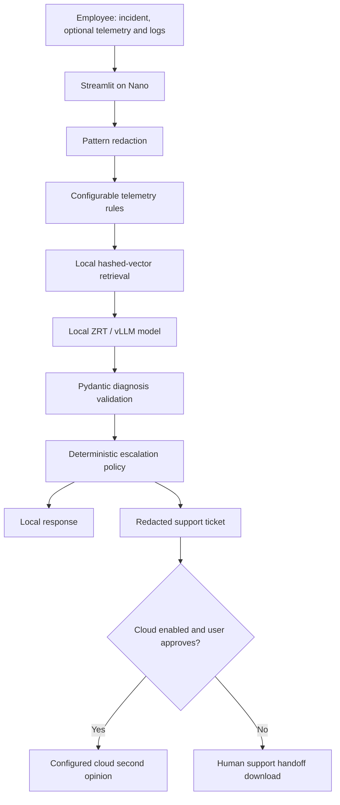

# EdgeSupport

An edge-first IT triage prototype for employees and help-desk technicians. Primary inference runs through a local HP ZRT/vLLM OpenAI-compatible endpoint on the ZGX Nano GB10. Cloud is disabled by default and is never a fallback for an unavailable local server.

## What model and dataset have we used?

| Component | Current implementation | What we can claim |
| --- | --- | --- |
| Local LLM | Configurable ZRT/vLLM model; `LOCAL_LLM_MODEL` is blank in the template | No real model has been selected or validated in this repository's recorded tests |
| Simulation | `SimulationProvider`, deterministic responses from telemetry signals | Workflow testing only; not AI inference |
| Suggested first model to test | `Qwen/Qwen2.5-7B-Instruct` | Deployment candidate, not a model already used or benchmarked |
| Cloud model | Configurable; disabled by default | No cloud model has been tested |
| Retrieval | Local hashed bag-of-words embeddings, 2048 dimensions | No downloaded embedding model; lexical retrieval |
| Knowledge corpus | Nine original synthetic Markdown troubleshooting documents | Demo/sample content, not official HP support documentation |
| Evaluation dataset | 13 original synthetic incidents in `data/evaluation.json` | A small workflow smoke dataset; not a representative public benchmark |
| Training/fine-tuning | None | We have not trained or fine-tuned a model |

**We have not used an external public dataset.** Publishing our synthetic cases in this repository does not make them an independently sourced benchmark. Do not claim Kaggle, Hugging Face, HP support tickets or any other external dataset was used. Future dataset integration should record the source URL, license, version, transformations and independent evaluation split. Do not mix evaluation cases into retrieval knowledge and then describe the result as held-out accuracy.

The suggested Qwen model is instruction-tuned, has approximately 7.61 billion parameters and provides vLLM deployment instructions. Its model card describes JSON-generation improvements, which make it a reasonable starting candidate for our schema-based output. This does not establish IT diagnostic accuracy or compatibility with the event's installed GB10 runtime; validate both. See the [official model card](https://huggingface.co/Qwen/Qwen2.5-7B-Instruct).

## How to use the app

1. Open the Streamlit URL printed by the run command or forwarded through VS Code.
2. Describe the issue, for example: `My laptop is slow during video calls`.
3. Optionally paste telemetry such as the example below, and paste or upload a UTF-8 log up to 20 KB.
4. Select any applicable failed-troubleshooting, specialist-request or high-risk flags.
5. Click **Diagnose locally**. Review the likely cause, actions, evidence, confidence, local latency and routing decision.
6. For `ESCALATE`, review/download the redacted support ticket. Cloud remains disabled unless configured; when enabled, review the payload, check the approval box and click **Send escalation to cloud**.

```json
{
  "cpu_percent": 96,
  "memory_percent": 91,
  "disk_percent": 94,
  "temperature_c": 91,
  "battery_health_percent": 62,
  "wifi_signal_percent": 32,
  "top_processes": [{"name": "chrome.exe", "cpu_percent": 70}]
}
```

These are synthetic readings. You do not need all fields. Percentage fields use 0–100. No commands are executed on the employee's device; remediation is advisory. A support ticket download does not send anything to an IT help desk.

## Quick start on a laptop

Run these commands in Terminal with Python 3.12 installed:

```bash
git clone https://github.com/abhinitasanabada-web/edgehack.git
cd edgehack
bash scripts/setup.sh
SIMULATION_MODE=true .venv/bin/python -m streamlit run app/ui.py --server.address 127.0.0.1
```

Open `http://localhost:8501`. Simulation needs no API key or GPU. Installation requires internet; after dependencies and the index are installed, the simulation operates offline. If you already cloned this repository, enter that folder instead of cloning again.

## Run on the assigned HP remote machine (“HP cloud”)

For this hackathon, the supplied infrastructure is an **HP ZGX Nano GB10 with 128 GB unified memory, accessed through HP ZTK/SSH**. Remotely accessing it does not make its inference a cloud API call. Run the primary workload on that assigned device. These instructions are not an HPE GreenLake deployment guide; no HPE cloud tenant, VM image or service endpoint has been supplied.

### 1. Connect to your assigned Nano

Use VS Code with the HP ZTK extension and your administrator-provided access details. Connect to your assigned device and open its remote Terminal. Keep access details out of Git. The following installation/model commands run **on the Nano**, not in your Mac Terminal.

### 2. Clone and install the application on the Nano

```bash
git clone https://github.com/abhinitasanabada-web/edgehack.git
cd edgehack
python3 --version
bash scripts/setup.sh
```

Use Python 3.12 for the pinned dependency snapshot. If `python3 -m venv` is unavailable, ask the administrator to install the matching Python venv package. The setup creates `.venv`, copies `.env.example` only if `.env` is absent, installs dependencies and builds the local index.

### 3. Pull and serve a local model with ZRT

Start with the installed event runtime rather than replacing its GPU stack. In a separate remote Terminal:

```bash
zrt --help
zrt status
zrt models
# Example candidate, not a previously validated deployment:
zrt pull Qwen/Qwen2.5-7B-Instruct
zrt serve hf:Qwen/Qwen2.5-7B-Instruct --host 127.0.0.1 --port 8000
```

The `hf:` serving syntax follows the supplied event guide. If your installed ZRT expects a different model identifier, use `zrt serve --help` and its model listing. Some versions accept the plain Hugging Face repository ID. Model download needs internet and disk space; offline inference is possible after installation. Do not start another server if a team member is already serving the model. Keep the server Terminal running, or use your team's approved process supervisor.

GB10 requires a compatible runtime build. The candidate model's vLLM support is not proof that any generic pip-installed vLLM build will run on the device. Account for weights, KV cache, context length and other workloads within unified memory. No training is needed for this prototype.

### 4. Configure the actual served ID

From another remote Terminal in `edgehack`:

```bash
curl --fail http://localhost:8000/v1/models
```

If the endpoint requires authentication, use its administrator-approved authentication procedure. Edit the local `.env` file in VS Code:

```dotenv
LOCAL_LLM_BASE_URL=http://localhost:8000/v1
# Replace with the EXACT id in the models response, including hf: if present.
LOCAL_LLM_MODEL=YOUR_EXACT_SERVED_MODEL_ID
LOCAL_LLM_API_KEY=
ENABLE_CLOUD=false
SIMULATION_MODE=false
```

`YOUR_EXACT_SERVED_MODEL_ID` is a placeholder. Leave the key empty only if your local endpoint permits it. Never commit `.env`. An unavailable server or invalid model response produces an error, not an automatic cloud fallback.

### 5. Start the UI and forward the port

```bash
.venv/bin/python -m streamlit run app/ui.py --server.address 127.0.0.1 --server.port 8501
```

In VS Code, open **Ports → Forward a Port → 8501**, then open its forwarded URL. Ports 8000 (model) and 8501 (UI) must be different. Keep the tunnel private. You can also forward the UI from your Mac using administrator-provided values:

```bash
ssh -N -L 8501:127.0.0.1:8501 YOUR_ASSIGNED_USERNAME@YOUR_ASSIGNED_HOST
```

Open `http://localhost:8501` on the Mac. Replace the placeholders locally; do not store real host details in the repository.

### 6. Validate real inference

Confirm the simulation banner is absent, submit a synthetic incident, and run:

```bash
.venv/bin/python -m pytest -q
.venv/bin/python scripts/benchmark.py --output reports/nano.json
```

Record the actual model/revision, quantization, ZRT/vLLM versions, context limit and workload conditions with your measurements. Real hardware results remain pending until these commands are run successfully on the Nano.

### Optional cloud escalation

In `.env`, configure `ENABLE_CLOUD=true`, `CLOUD_LLM_BASE_URL` (an HTTPS OpenAI-compatible endpoint ending in `/v1`), `CLOUD_LLM_MODEL` and `CLOUD_LLM_API_KEY`. Restart the UI after changing configuration. These fields do not select a provider automatically. The provider must support the adapter's chat-completions parameters and JSON response content. The app still calls the local model first; cloud requires a routing decision and a user-approved send action.

## Compare token usage: local versus cloud

Here, “normal” means local Nano inference. **Token count, model size and context capacity are different quantities.** An 8B model has roughly eight billion parameters; that does not mean eight billion tokens per request. `max_tokens=1500` in our adapter is an output cap, not observed usage or the model's full context window. Running locally does not inherently use fewer tokens.

The existing application adapter validates diagnosis content but **does not retain the API `usage` object**. The existing benchmark reports quality/routing and latency, not token counts. Do not claim token savings from its output. The diagnostic experiment below measures one synthetic request outside the UI; it is not automatic production telemetry.

### A. Compare the same diagnostic request on two endpoints

Use the same sanitized incident, retrieved knowledge, system prompt, schema, temperature and output cap. For hardware comparisons, use the same model, tokenizer, revision, chat template and generation settings on both deployments if possible. Different models can tokenize identical text differently, so report model identities alongside token counts and compare diagnosis quality too.

Run this from the repository root after building the index. By default it calls **only the local endpoint**. To intentionally include the configured cloud endpoint for this synthetic benchmark, set `TOKEN_COMPARE_CLOUD=true` in your shell before running it. This is an explicit experimental cloud baseline that bypasses the UI escalation policy; it does not change application behavior. It may incur provider charges. Review your knowledge corpus first: retrieved text is included, and pattern redaction is incomplete DLP.

```bash
# Optional, only when you intend to send this benchmark to your configured cloud:
# export TOKEN_COMPARE_CLOUD=true
.venv/bin/python - <<'PY'
import json, os, time
from pathlib import Path
from urllib.parse import urlparse
import httpx
from app.config import Settings
from app.models import Diagnosis, Incident
from app.services.provider import SYSTEM
from app.services.privacy import sanitize
from app.services.telemetry import analyze
from app.services.retrieval import retrieve

s = Settings.from_env()
incident = Incident(description="My laptop is slow during video calls", telemetry={"cpu_percent": 96})
signals = analyze(incident.telemetry, s.thresholds)
payload, _ = sanitize({
    "incident": incident.model_dump(), "signals": signals,
    "knowledge": retrieve(incident.description + " " + " ".join(x["category"] for x in signals)),
})
messages = [
    {"role": "system", "content": SYSTEM + "\nSchema: " + json.dumps(Diagnosis.model_json_schema())},
    {"role": "user", "content": json.dumps(payload)},
]
targets = [("local", s.local_url, s.local_model, s.local_key)]
if os.getenv("TOKEN_COMPARE_CLOUD", "false").lower() == "true":
    targets.append(("cloud", s.cloud_url, s.cloud_model, s.cloud_key))
rows = []
for location, url, model, key in targets:
    parsed = urlparse(url)
    if not model or parsed.scheme not in {"http", "https"} or not parsed.hostname:
        raise SystemExit("Configure a valid endpoint and model ID before measuring.")
    if parsed.username or parsed.password:
        raise SystemExit("Do not embed credentials in endpoint URLs.")
    if location == "local" and parsed.hostname not in {"localhost", "127.0.0.1", "::1", "host.docker.internal"}:
        raise SystemExit("Use a loopback local endpoint or an SSH tunnel.")
    if location == "cloud" and parsed.scheme != "https":
        raise SystemExit("Cloud endpoint must use HTTPS.")
    body = {"model": model, "messages": messages, "temperature": 0, "max_tokens": 1500}
    headers = {"Authorization": f"Bearer {key}"} if key else {}
    start = time.perf_counter()
    try:
        with httpx.Client(timeout=s.timeout, trust_env=False, follow_redirects=False) as client:
            response = client.post(url.rstrip("/") + "/chat/completions", json=body, headers=headers)
        response.raise_for_status()
        data = response.json()
    except (httpx.HTTPError, ValueError):
        raise SystemExit(f"{location} request failed. Check endpoint health, credentials and compatibility.")
    elapsed = (time.perf_counter() - start) * 1000
    try:
        Diagnosis.model_validate_json(data["choices"][0]["message"]["content"])
        valid = True
    except (ValueError, KeyError, IndexError, TypeError):
        valid = False
    usage = data.get("usage") or {}
    rows.append({"location": location, "model": model, "latency_ms": round(elapsed, 2),
                 "valid_diagnosis": valid,
                 "prompt_tokens": usage.get("prompt_tokens"),
                 "completion_tokens": usage.get("completion_tokens"),
                 "total_tokens": usage.get("total_tokens")})
Path("reports").mkdir(exist_ok=True)
Path("reports/token-comparison.json").write_text(json.dumps(rows, indent=2))
print(json.dumps(rows, indent=2))
PY
```

The snippet imports the same system prompt/schema and uses the same retrieval/rule components. It sends one fixed synthetic case; it does not calculate accuracy, average performance or full-workload savings. `null` usage means the endpoint did not return that field, not zero tokens. API usage normally includes chat-template overhead; local word/character counts are not a substitute. See [vLLM chat-completion serving and usage accounting](https://docs.vllm.ai/en/v0.25.0/api/vllm/entrypoints/openai/chat_completion/serving/).

Record results in a table like this; fill it only from real responses:

| Endpoint/model | Input tokens | Output tokens | Total tokens | Round-trip latency | Valid diagnosis |
| --- | --- | --- | --- | --- | --- |
| Nano / actual model ID | Pending | Pending | Pending | Pending | Pending |
| Cloud / actual model ID | Pending | Pending | Pending | Pending | Pending |

Repeat with the same held-out cases and report sample count, failures, mean tokens, p50/p95 latency and category/routing quality. Do not drop failed or invalid responses from token/cost accounting. Include warmup policy and concurrency. Capture reasoning/cached-token details separately if your provider exposes them. Round-trip latency includes network and prefill; `output_tokens / round_trip_seconds` is not pure GPU decoding throughput.

### B. Compare an edge-first workload with a cloud-only baseline

Use the same set of incidents and the same cloud model for both systems. This is a separate experiment from comparing individual local and cloud requests.

- **Cloud-only baseline:** record cloud input/output tokens for every incident using a documented prompt.
- **Edge-first:** record local usage for every incident; record cloud usage only for approved escalations. Include the actual escalation ticket, which contains additional local diagnosis/context and may be longer than a baseline prompt.
- Sum real cloud usage for each workflow; do not assume one avoided request equals a fixed number of tokens.

```text
cloud_token_reduction_percent = 100 * (1 - edge_first_cloud_tokens / baseline_cloud_tokens)
cloud_cost = (input_tokens * input_price_per_million
              + output_tokens * output_price_per_million) / 1_000_000
```

The reduction is undefined if baseline tokens are zero. Different input/output prices, cache discounts, reasoning-token billing and failed requests can affect cost; use the provider's current billing rules. Report cloud-token savings separately from total compute: edge-first still uses local tokens and incurs hardware/energy costs. Escalations use both local and cloud inference, so total tokens or latency may increase even while cloud usage decreases.

With `ENABLE_CLOUD=false`, this app sends zero cloud requests, but that alone does not prove equivalent quality, resolved incidents or a measured percentage reduction. Report human handoffs and unresolved cases as well. The stock benchmark deliberately makes no cloud calls; full workflow token accounting remains a future instrumentation task.


## Architecture



The routing decision and actual processing location are separate: recommending escalation does not mean data left the device. `ESCALATED` is shown after a successful approved cloud response. A failed cloud request may already have transmitted data; the UI explicitly says so. High-risk incidents still need human review regardless of a cloud second opinion. The app never executes remediation commands or submits tickets automatically.

## Configuration

Copy `.env.example` to `.env` (setup does this if missing). Local variables: `LOCAL_LLM_BASE_URL`, `LOCAL_LLM_MODEL`, optional `LOCAL_LLM_API_KEY`. Cloud variables: `ENABLE_CLOUD`, `CLOUD_LLM_BASE_URL`, `CLOUD_LLM_MODEL`, `CLOUD_LLM_API_KEY`. Cloud URLs must use HTTPS. Set `LLM_TIMEOUT_SECONDS` and `CONFIDENCE_THRESHOLD` as needed. Telemetry thresholds live in `data/thresholds.json` and are illustrative, not universal device limits.

The escalation module returns `LOCAL` or `ESCALATE`, with reason codes for low confidence, unsupported category, high risk, insufficient evidence, failed troubleshooting, specialist requests and explicit model requests. Confidence at the threshold passes. Severity `high`, an explicit risk flag, or simple physical/security/data-loss risk phrases trigger escalation. The phrase detector is deliberately conservative and incomplete; it is not a safety classifier. Model confidence is self-reported and uncalibrated.

## Local knowledge

Nine Markdown documents in `data/knowledge/` are clearly marked DEMO/SAMPLE, not official HP guidance. Add licensed, reviewed enterprise/HP documentation as Markdown and rebuild:

```bash
.venv/bin/python scripts/build_index.py
```

Ingestion uses overlapping character chunks and SHA-256 hashed normalized bag-of-words vectors (2048 dimensions). This is a lightweight lexical embedding baseline with cosine similarity, not a pretrained semantic model. It runs offline with no extra model downloads. Replace `embed()` and version/rebuild the index for another embedding model. The JSON vector index is generated locally and excluded from Git. No websites are scraped at inference time. Retrieval similarity is not diagnostic confidence or verified source grounding.

## Privacy and limitations

Emails, IPv4-like addresses, usernames in common paths, labeled secrets, common token prefixes, bearer tokens and private-key blocks are redacted before local inference and again at cloud egress. Local model output and retrieved documents are included in egress redaction. Original user inputs stay in the Streamlit session; no incident persistence or application request logging is implemented. The model server or cloud provider may have its own logging policy.

This is best-effort pattern redaction, **not complete DLP**: names, IPv6 addresses, proprietary text and unusual secrets may remain. Review the full payload before cloud submission or support-ticket export. Logs and documents are untrusted prompt data. Prompt injection is mitigated by system instructions, no execution tools and explicit cloud consent, but is not solved. This prototype has no authentication or enterprise authorization; bind to loopback and use SSH forwarding. Do not expose it publicly as a production service.

## Tests and benchmarks

```bash
.venv/bin/python -m pytest -q
.venv/bin/python scripts/benchmark.py --simulate --output reports/simulation.json
# REAL local-model evaluation on Nano:
.venv/bin/python scripts/benchmark.py --output reports/nano.json
```

`data/evaluation.json` contains 13 synthetic cases covering telemetry categories, log/text problems, unsupported problems and escalation flags. Expected categories/routes are demo labels, not ground truth from technicians. Reports include timestamp, architecture, configured model, per-case results, success rate, category accuracy, route accuracy, local-resolution rate, p50/p95 total latency and inference latency. Failures remain in accuracy denominators; latency quantiles use successful requests only. These tiny samples are smoke evaluations, not production accuracy claims. A conservative model may reasonably escalate a case labeled local: inspect disagreements. Cloud requests are zero by design in this benchmark.

Use an offline Nano run after models and dependencies are installed to demonstrate independence from cloud connectivity. Record model ID, quantization, ZRT/vLLM version, context length, concurrent workloads and hardware alongside results. Run a warmup before repeated measured runs; this simple runner otherwise includes first-request effects. Do not claim cost savings or GPU throughput from fixture tests. Real Nano measurements are required before claiming hardware performance.

## Docker

The image contains the application, not the GPU model server. On the Linux Nano, host networking allows loopback access to ZRT:

```bash
docker build -t edgesupport .
docker run --rm --network host --env-file .env edgesupport \
  python -m streamlit run app/ui.py --server.address 127.0.0.1
```

For Docker Desktop use `LOCAL_LLM_BASE_URL=http://host.docker.internal:8000/v1` and publish `-p 127.0.0.1:8501:8501`. Configure endpoint access on the host appropriately. `.dockerignore` excludes credentials and reports; `.gitignore` excludes `.env`, runtime files and generated reports. Inspect any report before explicitly publishing it. Never add event credentials, private addresses, keys or the supplied event PDF to the public repo.

## Five-minute demonstration

1. Show simulation is off and identify the local model/device.
2. Diagnose CPU 96% with normal network connectivity; show signals, local evidence, latency and route.
3. Disable external internet while keeping local/SSH access intact; repeat and show local inference succeeds.
4. Check “Request specialist support”; show `USER_REQUESTED` and a redacted ticket with cloud disabled.
5. If configured, review and explicitly send one sanitized cloud escalation; compare its location and latency.
6. Present real Nano benchmark results and acknowledge the small synthetic dataset.

The supplied request ended at the DATASET heading; the synthetic dataset and evaluation approach are implementation choices. The code is published in this GitHub repository; no cloud account or external hackathon submission is created by the application.

## Implementation references

- [vLLM OpenAI-compatible serving](https://docs.vllm.ai/en/latest/serving/openai_compatible_server/)
- [Streamlit forms](https://docs.streamlit.io/develop/api-reference/execution-flow/st.form)
- [Streamlit file uploader](https://docs.streamlit.io/develop/api-reference/widgets/st.file_uploader)

The supplied HP event reference informed the Nano/ZTK/ZRT deployment flow. Its access details are intentionally not reproduced.
