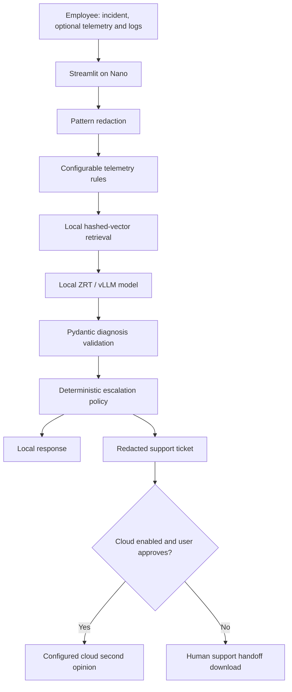

# EdgeSupport

An edge-first IT triage prototype for employees and help-desk technicians. Primary inference runs through a local HP ZRT/vLLM OpenAI-compatible endpoint on the ZGX Nano GB10. Cloud is disabled by default and is never a fallback for an unavailable local server.

## Run on your Nano

Python 3.12 is recommended; setup and Docker install the included pinned dependency snapshot in `requirements-lock.txt`. Open your assigned Nano through VS Code + HP ZTK over SSH. Follow your event administrator's installation instructions for ZRT; do not copy event credentials into this repository.

```bash
bash scripts/setup.sh
# Pull and serve a compatible instruction model using your installed ZRT version.
zrt --help
zrt models
zrt status
# Inspect the served ID (the API ID may differ from the Hugging Face repository name):
curl http://localhost:8000/v1/models
# Edit .env: set LOCAL_LLM_MODEL to that exact ID.
.venv/bin/python -m streamlit run app/ui.py --server.address 127.0.0.1
```

Use VS Code's Ports panel to forward port 8501 privately and open the forwarded URL. Run the app and model on the Nano. Alternatively, tunnel the Nano's model port to localhost when developing from your laptop. `LOCAL_LLM_BASE_URL` defaults to `http://localhost:8000/v1`. Confirm that your endpoint actually points to the assigned Nano: loopback validation cannot prove hardware provenance. ZRT versions and model serving flags vary; consult `zrt --help` and your supplied HP guide. No model download or hardware access is included in this repository.

The adapter uses `/chat/completions`, temperature 0, a JSON schema in the prompt, and Pydantic validation. It deliberately avoids version-specific constrained-decoding flags. Use a model with a functioning chat template and reliable JSON output. Model selection must account for runtime/KV-cache overhead, quantization, context and concurrent load; 128 GB unified memory is not all available for weights. Invalid responses produce a visible error and never trigger cloud inference.

## Run without a model (explicit simulation)

```bash
SIMULATION_MODE=true .venv/bin/python -m streamlit run app/ui.py
```

Enter `My laptop is slow` and telemetry `{"cpu_percent":96}`. The UI visibly labels fixture responses as **SIMULATION**, not local LLM inference. This mode tests the workflow only and cannot demonstrate Nano model quality or latency. Disable it for the hackathon demo.

## Architecture



The routing decision and actual processing location are separate: recommending escalation does not mean data left the device. `ESCALATED` is shown after a successful approved cloud response. A failed cloud request may already have transmitted data; the UI explicitly says so. High-risk incidents still need human review regardless of a cloud second opinion. The app never executes remediation commands or submits tickets automatically.

## Configuration

Copy `.env.example` to `.env` (setup does this if missing). Local variables: `LOCAL_LLM_BASE_URL`, `LOCAL_LLM_MODEL`, optional `LOCAL_LLM_API_KEY`. Cloud variables: `ENABLE_CLOUD`, `CLOUD_LLM_BASE_URL`, `CLOUD_LLM_MODEL`, `CLOUD_LLM_API_KEY`. Cloud URLs must use HTTPS. Set `LLM_TIMEOUT_SECONDS` and `CONFIDENCE_THRESHOLD` as needed. Telemetry thresholds live in `data/thresholds.json` and are illustrative, not universal device limits.

The escalation module returns `LOCAL` or `ESCALATE`, with reason codes for low confidence, unsupported category, high risk, insufficient evidence, failed troubleshooting, specialist requests and explicit model requests. Confidence at the threshold passes. Severity `high`, an explicit risk flag, or simple physical/security/data-loss risk phrases trigger escalation. The phrase detector is deliberately conservative and incomplete; it is not a safety classifier. Model confidence is self-reported and uncalibrated.

## Local knowledge

Nine Markdown documents in `data/knowledge/` are clearly marked DEMO/SAMPLE, not official HP guidance. Add licensed, reviewed enterprise/HP documentation as Markdown and rebuild:

```bash
.venv/bin/python scripts/build_index.py
```

Ingestion uses overlapping character chunks and SHA-256 hashed normalized bag-of-words vectors (2048 dimensions). This is a lightweight lexical embedding baseline with cosine similarity, not a pretrained semantic model. It runs offline with no extra model downloads. Replace `embed()` and version/rebuild the index for another embedding model. The JSON vector index is generated locally and excluded from Git. No websites are scraped at inference time. Retrieval similarity is not diagnostic confidence or verified source grounding.

## Privacy and limitations

Emails, IPv4-like addresses, usernames in common paths, labeled secrets, common token prefixes, bearer tokens and private-key blocks are redacted before local inference and again at cloud egress. Local model output and retrieved documents are included in egress redaction. Original user inputs stay in the Streamlit session; no incident persistence or application request logging is implemented. The model server or cloud provider may have its own logging policy.

This is best-effort pattern redaction, **not complete DLP**: names, IPv6 addresses, proprietary text and unusual secrets may remain. Review the full payload before cloud submission or support-ticket export. Logs and documents are untrusted prompt data. Prompt injection is mitigated by system instructions, no execution tools and explicit cloud consent, but is not solved. This prototype has no authentication or enterprise authorization; bind to loopback and use SSH forwarding. Do not expose it publicly as a production service.

## Tests and benchmarks

```bash
.venv/bin/python -m pytest -q
.venv/bin/python scripts/benchmark.py --simulate --output reports/simulation.json
# REAL local-model evaluation on Nano:
.venv/bin/python scripts/benchmark.py --output reports/nano.json
```

`data/evaluation.json` contains 13 synthetic cases covering telemetry categories, log/text problems, unsupported problems and escalation flags. Expected categories/routes are demo labels, not ground truth from technicians. Reports include timestamp, architecture, configured model, per-case results, success rate, category accuracy, route accuracy, local-resolution rate, p50/p95 total latency and inference latency. Failures remain in accuracy denominators; latency quantiles use successful requests only. These tiny samples are smoke evaluations, not production accuracy claims. A conservative model may reasonably escalate a case labeled local: inspect disagreements. Cloud requests are zero by design in this benchmark.

Use an offline Nano run after models and dependencies are installed to demonstrate independence from cloud connectivity. Record model ID, quantization, ZRT/vLLM version, context length, concurrent workloads and hardware alongside results. Run a warmup before repeated measured runs; this simple runner otherwise includes first-request effects. Do not claim cost savings or GPU throughput from fixture tests. Real Nano measurements are required before claiming hardware performance.

## Docker

The image contains the application, not the GPU model server. On the Linux Nano, host networking allows loopback access to ZRT:

```bash
docker build -t edgesupport .
docker run --rm --network host --env-file .env edgesupport \
  python -m streamlit run app/ui.py --server.address 127.0.0.1
```

For Docker Desktop use `LOCAL_LLM_BASE_URL=http://host.docker.internal:8000/v1` and publish `-p 127.0.0.1:8501:8501`. Configure endpoint access on the host appropriately. `.dockerignore` excludes credentials and reports; `.gitignore` excludes `.env`, runtime files and generated reports. Inspect any report before explicitly publishing it. Never add event credentials, private addresses, keys or the supplied event PDF to the public repo.

## Five-minute demonstration

1. Show simulation is off and identify the local model/device.
2. Diagnose CPU 96% with normal network connectivity; show signals, local evidence, latency and route.
3. Disable external internet while keeping local/SSH access intact; repeat and show local inference succeeds.
4. Check “Request specialist support”; show `USER_REQUESTED` and a redacted ticket with cloud disabled.
5. If configured, review and explicitly send one sanitized cloud escalation; compare its location and latency.
6. Present real Nano benchmark results and acknowledge the small synthetic dataset.

The supplied request ended at the DATASET heading; the synthetic dataset and evaluation approach are implementation choices. No public repository, cloud account or external submission is created automatically.

## Implementation references

- [vLLM OpenAI-compatible serving](https://docs.vllm.ai/en/latest/serving/openai_compatible_server/)
- [Streamlit forms](https://docs.streamlit.io/develop/api-reference/execution-flow/st.form)
- [Streamlit file uploader](https://docs.streamlit.io/develop/api-reference/widgets/st.file_uploader)

The supplied HP event reference informed the Nano/ZTK/ZRT deployment flow. Its access details are intentionally not reproduced.
